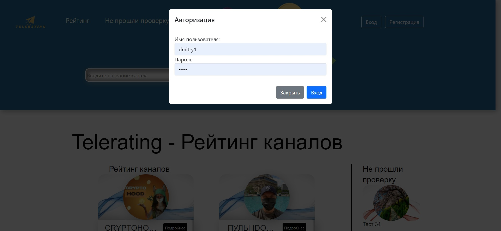
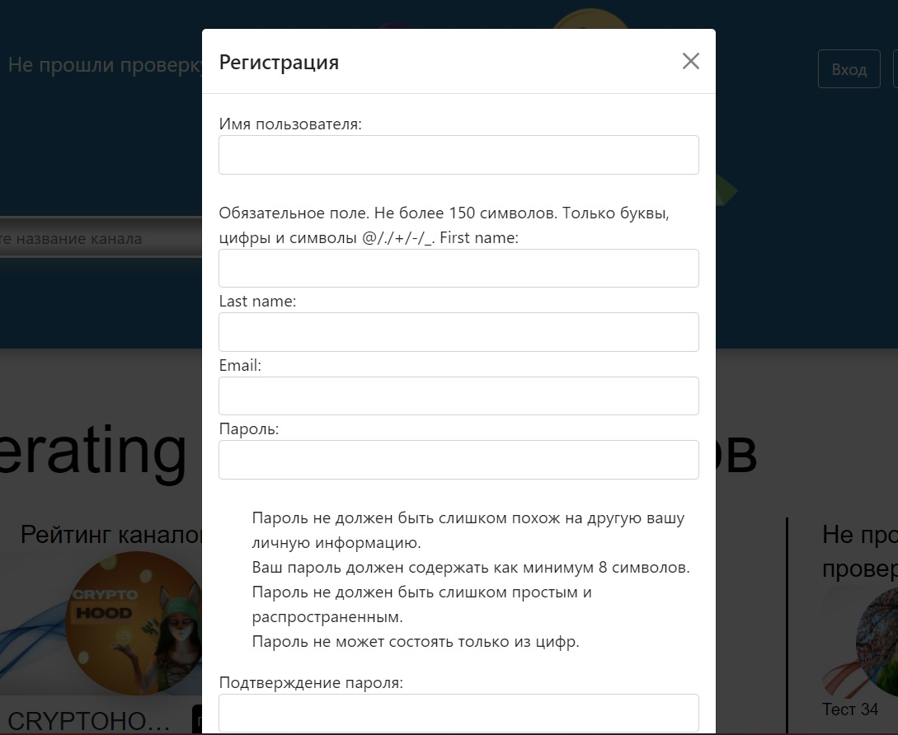
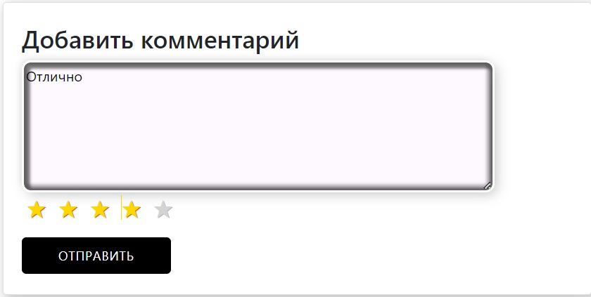
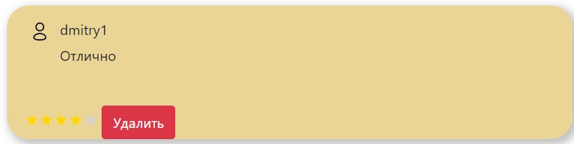
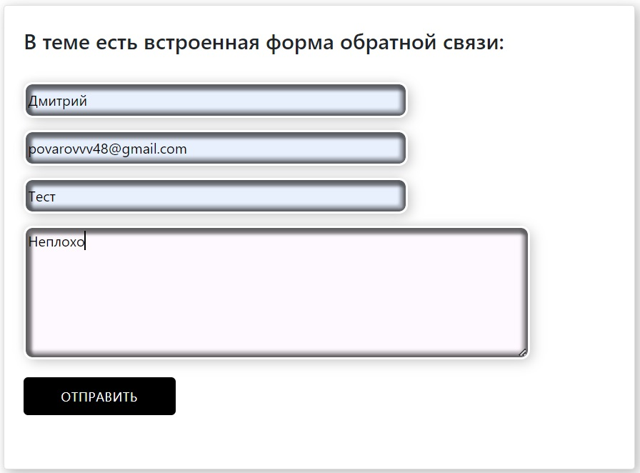
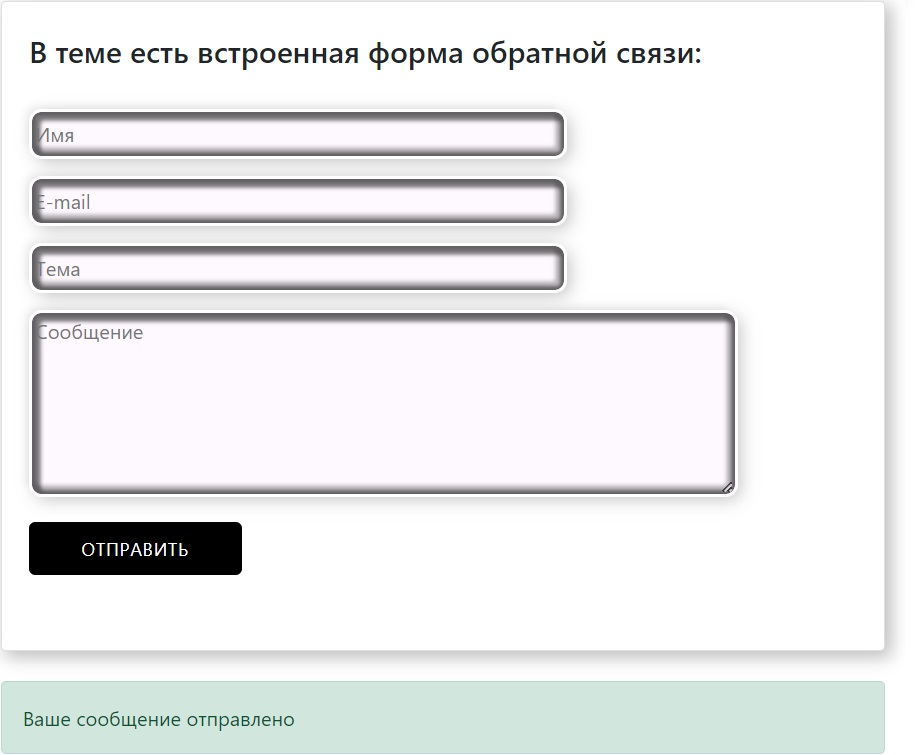
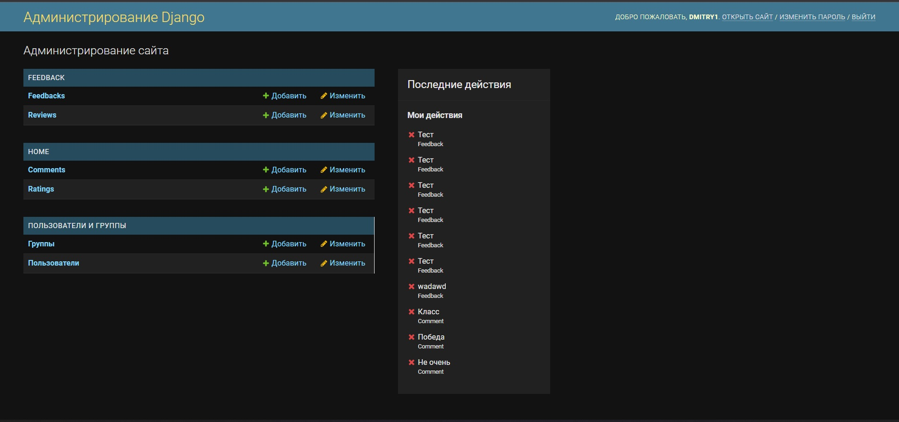

<h1 align="center">
Telerating
</h1>
<p align="center">
Этот сайт помогает пользователям находить проверенные Telegram каналы по инвестициям
</p>

# Установка
```
git clone https://github.com/DmitrI2488/Site-3.git
cd Site-3
pip install django
pip install requests
pip install Babel
python3 manage.py runserver
```
*Сайт будет доступен на локальном адресе http://127.0.0.1:8000/*

<h1 align="center">
Функционал сайта
</h1>
<h3>Для пользователя</h3>
<ul>
    <li>Регистрация и авторизация, восстановление пароля</li>
    <li>Просмотр каналов прошедших и не прошедших проверку</li>
	<li>Возможность оставлять и удалять коментарии</li>
	<li>Наличие обратной связи с Администрацией сайта</li>
	<li>Возможность предоставить свои каналы на проверку</li>
	<li>Поисковая система по спискам каналов</li>
</ul>
<h3>Для администратора</h3>
<ul>
    <li>Просмотр последних действий, соверешенных администраторами</li>
    <li>Разграничение групп и прав пользователей</li>
    <li>Редактирование и добавление каналов</li>
    <li>Удаление и скрытие комментариев с плохими отзывами</li>
    <li>Просмотр сообщений обратной связи</li>
    <li>Просмотр каналов оставленных на проверку</li>
</ul>


## Регистрация и авторизация


</br>
</br>



Описание:
```
Регистрация и авторизация реализованы через базовые функции Django и Ajax
Благодаря Ajax страница не обновляется, а авторизация и регистрация появляется
во всплывающем окне
```

## Комментари



*Определение рейтинга по числу звезд реализовано при помощи javascript*

Результат:



## Обратная связь



*Здесь также используется технология ajax*

Результат:



<h2>Для Администратора</h2>
<h3>Все функции администратора реализованы через админ панель которая находится по адресу http://127.0.0.1:8000/admin/ </h3>


<h1>Программные средства и технические особоенности</h1>
<h3>Инструменты разработки:</h3>
<ul>
<li> Back-end </li>
<ul>
    <li>Python 3</li>
    <li>Django 4</li>
    <li>SqLite3</li>
</ul>
</ul>
<ul>
<li> Front-End </li>
<ul>
    <li>html5</li>
    <li>css3</li>
    <li>javascript</li>
    <li>BootStrap5</li>
</ul>
</ul>
<ul>
<li> Связь back и front: </li>
<ul>
    <li>Ajax</li>
</ul>
</ul>
<h3> Технические особенности </h3>
<ul>
    <li>Адаптивность под разные устройства</li>
	<li>Оптимизация использования данных при помощи Ajax</li>
</ul>

## Остались вопросы?
* Задайте их [Telegram](https://t.me/dmitri2488)


